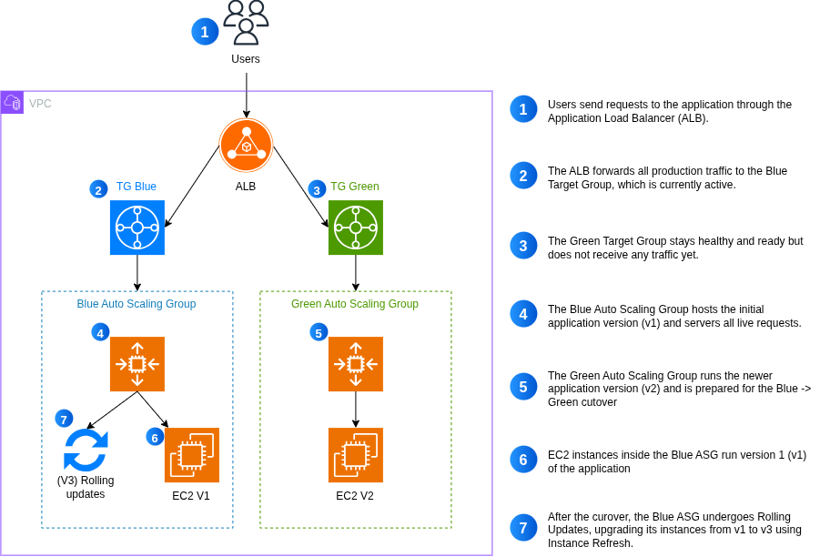
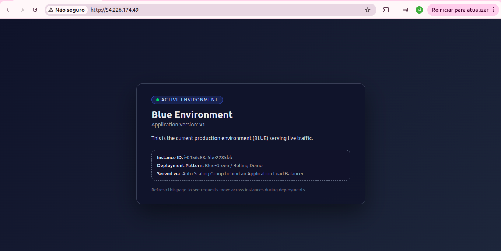
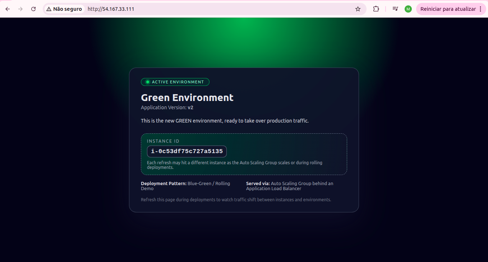
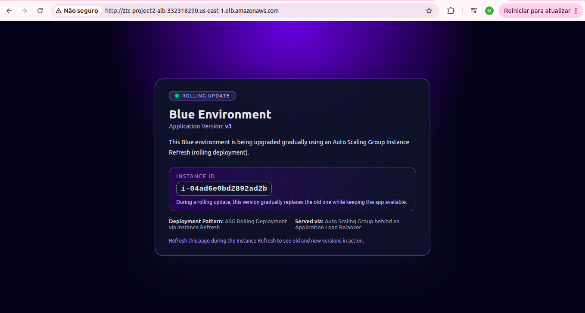

# Blue Green and Rolling Infrastructure Deployments

This project demonstrates the implementation of a zero-downtime deployment system on AWS using Blue-Green Deployments, Rolling Deployments, Auto Scaling Groups, Launch Templates, Lifecycle Hooks, and Warm Pools.

The architecture is based on a lab created by Lucy Wang (Tech With Lucy). Beyond implementing the solution, my main goal was to understand the reasoning behind each deployment strategy and how different AWS services work together to provide reliable application releases without interrupting users

# Business Problem

A growing software company runs an internal web application behind an Application Load Balancer using a basic Auto Scaling Group.

Although this architecture already provides scalability and automatic instance replacement, it lacks a structured deployment process.

As the engineering team begins releasing new features more frequently, several operational challenges emerge:

- Deployments may cause downtime
- Users may access partially updated application versions
- New releases cannot be safely validated before production
- Rollbacks are slow and manual
- Infrastructure updates become difficult to manage predictably

The objective of this project is to design and implement a deployment strategy that enables continuous delivery while maintaining application availability.

# Solution Overview

The solution combines multiple deployment strategies and Auto Scaling features to provide safe application releases.

The architecture consists of:

- Application Load Balancer
- Two Target Groups
- Blue Environment
- Green Environment
- Launch Templates
- Auto Scaling Groups
- Rolling Deployments
- Instance Refresh
- Lifecycle Hooks
- Warm Pools

Rather than updating production servers directly, new application versions are deployed into an isolated environment. Once validated, production traffic is redirected through the Application Load Balancer without interrupting users.

# Architecture

The following diagram illustrates the high-level architecture of the zero-downtime deployment system, highlighting how the Blue and Green environments, Auto Scaling Groups, Target Groups, and the Application Load Balancer work together to enable safe application releases.

  


# Implementation

## Launch Templates

The project begins by defining a Launch Template.

Instead of configuring EC2 instances manually, every infrastructure characteristic is stored inside the template, including:

- Amazon Machine Image (AMI)
- Instance Type
- Security Group
- IAM Role
- SSH Key Pair
- User Data

Using Launch Templates ensures that every EC2 instance created by an Auto Scaling Group is identical, eliminating configuration drift and simplifying future deployments.

The IAM Role is attached directly to the Launch Template, allowing every new instance to automatically receive the required AWS permissions without relying on long-lived credentials.

The User Data script installs a lightweight web application that displays both the deployment environment (Blue or Green) and the EC2 Instance ID, making it easy to visualize traffic distribution during deployments.

## Auto Scaling Groups

Instances are created exclusively through Auto Scaling Groups.

Each Auto Scaling Group references a Launch Template, allowing infrastructure to be provisioned automatically rather than manually creating EC2 instances.

Besides simplifying provisioning, this approach provides several operational benefits:

- Automatic instance replacement
- Fault tolerance
- Consistent infrastructure
- Support for Rolling Deployments
- Easy creation of independent Blue and Green environments

For this project, each environment maintains a minimum of two instances and can scale up to four if necessary.

## Blue-Green Deployment

Instead of deploying directly into production, the application runs simultaneously in two completely independent environments.

- Blue represents the current production version.
- Green hosts the new application version.

Each environment has:

- Its own Launch Template
- Its own Auto Scaling Group
- Its own Target Group

The screenshots below show the EC2 instances created for each environment. Although they run independently, both environments are provisioned from their respective Launch Templates, ensuring consistent infrastructure while allowing different application versions to coexist safely.

  

  

The Green environment can be fully deployed and validated before receiving any production traffic.

Only after its instances pass the configured health checks is traffic redirected from Blue to Green through the Application Load Balancer.

## Traffic Switching

The Application Load Balancer is the central component behind the deployment strategy.

Rather than exposing users directly to EC2 instances, every request passes through the ALB.

The key design decision is maintaining a single ALB with two independent Target Groups.

Updating the ALB Listener is all that is required to redirect production traffic between Blue and Green, allowing deployments to occur without interrupting users.


## Rolling Deployments

While Blue-Green Deployments are used to promote a completely new application version, infrastructure within an existing environment also needs to evolve over time.

To simulate this scenario, a new Launch Template version was created for the Blue environment with an updated application version. Rather than replacing every EC2 instance simultaneously, the Blue Auto Scaling Group was updated to use the new Launch Template, and an **Instance Refresh** was initiated.

During the Instance Refresh, the Auto Scaling Group gradually launched new instances from the updated Launch Template while terminating older ones only after healthy replacements became available. This ensured that the Blue environment remained available throughout the update process.

The rolling update configuration used in this project includes:

- Minimum Healthy Percentage: 50%
- Instance Warmup: 60 seconds
- Skip Matching: Disabled

This approach demonstrates how infrastructure can be updated safely without requiring a second deployment environment, making Rolling Deployments an effective strategy for applying changes within a single Auto Scaling Group.

  


## Lifecycle Hooks

During a rolling deployment, instances should not be terminated immediately after replacement.

Lifecycle Hooks delay termination long enough for an instance to:

- Stop receiving new requests
- Finish processing active connections
- Shut down gracefully

This behavior closely resembles production deployment practices and helps prevent user-facing errors during infrastructure updates.


## Warm Pools

Warm Pools maintain pre-initialized EC2 instances that are ready to join the Auto Scaling Group.

Instead of waiting for a completely new instance to boot, install software, execute User Data, and pass health checks, a warm instance can become available much faster.

This significantly reduces the duration of future rolling deployments.

# Troubleshooting

During implementation, the application initially failed to start after the first deployment.

By inspecting the cloud-init logs:

```bash
sudo cat /var/log/cloud-init-output.log
```

I discovered an error inside the User Data script caused by an incorrect character in the download URL.

Because Launch Templates are immutable, the solution was to:

- Create a new Launch Template version
- Update the Auto Scaling Group to use the new version
- Execute an Instance Refresh

The Auto Scaling Group gradually replaced every instance, and the Target Group automatically registered the healthy replacements.

This experience reinforced an important production practice: infrastructure should be corrected by replacing instances rather than modifying running servers.

# What I Learned

This project helped me better understand how multiple AWS services combine to create a complete deployment strategy rather than solving problems independently.

Some of the most valuable concepts explored include:

- Designing Blue-Green deployment workflows
- Understanding how ALB traffic shifting enables zero downtime
- Using Launch Templates to build immutable infrastructure
- Applying Instance Refresh for safe infrastructure updates
- Understanding the complementary roles of Blue-Green and Rolling Deployments
- Improving deployment reliability with Lifecycle Hooks and Warm Pools

# Final Thoughts

This project reinforced an important lesson: effective cloud architectures don't start with AWS services, they start with a business problem.

In this case, the objective was to build a deployment process that could release new application versions without interrupting users. Every design decision, from Blue-Green Deployments and traffic switching with the Application Load Balancer to Rolling Deployments, Launch Templates, Lifecycle Hooks, and Warm Pools, was driven by that single goal.

# Acknowledgements

This project is based on the AWS lab created by **Lucy Wang (Tech With Lucy)**.

The implementation, documentation, architectural analysis, and deployment design explanations presented in this repository reflect my own understanding and learning throughout the project.

